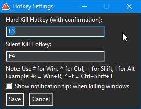

---

## 🎯 Hard Kill Active Window

A lightweight AutoHotkey utility that provides keyboard shortcuts to forcefully terminate unresponsive or problematic windows. Perfect for when Task Manager is too slow or applications freeze completely.

___

## ☑️ Main settings window with customizable hotkeys



___

## ✨ Features

- ⚡ Instant Process Termination - Kill frozen applications with a single keystroke
- 🎮 Two Kill Modes:
  - Hard Kill (Default: F3) - Shows confirmation dialog before terminating
  - Silent Kill (Default: F4) - Kills immediately with optional tray notification
- 🔧 Fully Customizable Hotkeys - Support for modifier keys (Ctrl, Alt, Shift, Win)
- 🌙 Dark Mode GUI - Easy-on-the-eyes settings interface
- 💾 Persistent Settings - Your preferences are saved to an INI file
- 🛡️ Safety Features - Cannot kill critical system windows (Desktop, Taskbar, Rainmeter)
- 🔔 Optional Notifications - Toggle tray notifications on/off

___

## 🎥 Demo

[E1.gif Settings](Images/E1.gif)
Demonstration killing Notepad++ process

___

## 📥 Installation

1. Download and install AutoHotkey (v1.1 or later)
2. Download Hard_Kill_Active_Window.ahk from the releases page
3. Double-click the script to run it
4. Press Ctrl+G to open settings and customize hotkeys
5. (Optional) Add to startup folder for automatic execution

___

## 🎯 Usage

- Action Default Hotkey Description
- Hard Kill F3 Shows confirmation dialog before killing
- Silent Kill F4 Kills immediately with optional notification
- Open Settings Ctrl+G Opens the configuration window

___

## ⚙️ Custom Hotkey Syntax

- Modifier Symbol Example Result
- Windows Key # #r Win+R
- Control ^ ^+t Ctrl+Shift+T
- Shift + +F5 Shift+F5
- Alt ! !F4 Alt+F4

___

## 🚀 Advanced Features

· Automatic Admin Rights - Script automatically requests administrator privileges when needed
· Process Validation - Skips protected system windows (Desktop, Taskbar, Rainmeter)
· Dual Kill Methods - Uses both WinClose and taskkill for maximum effectiveness
· Portable Settings - Configuration saved to HotkeySettings.ini in script directory

___

## 🛠️ Building from Source

No compilation needed! Simply run the .ahk file with AutoHotkey installed or download .exe file. To create an executable:

```bash
# Using Ahk2Exe compiler
Ahk2Exe.exe /in Hard_Kill_Active_Window.ahk /out Hard_Kill_Active_Window.exe
```
___

## 📝 Requirements

· Windows 7/8/10/11
· AutoHotkey v1.1 or later

___

## 🤝 Contributing

Contributions are welcome! Please feel free to submit a Pull Request.

1. Fork the repository
2. Create your feature branch (git checkout -b feature/AmazingFeature)
3. Commit your changes (git commit -m 'Add some AmazingFeature')
4. Push to the branch (git push origin feature/AmazingFeature)
5. Open a Pull Request

___

## 📄 License

This project is licensed under the Creative Commons Attribution-NonCommercial-NoDerivatives 4.0 International License - see the LICENSE file for details.

You are free to:

· Share — copy and redistribute the material in any medium or format

Under the following terms:

· Attribution — You must give appropriate credit
· NonCommercial — You may not use the material for commercial purposes
· NoDerivatives — If you remix, transform, or build upon the material, you may not distribute the modified material

___

## ⭐ Support

If you find this tool useful, please consider:

· Giving it a star ⭐ on GitHub
· Sharing it with others who might need it
· Reporting bugs or suggesting features

___

## 🙏 Acknowledgments

· AutoHotkey community for the excellent documentation and examples
· Contributors who helped test and improve the script

---

Made with ❤️ for the AutoHotkey community by AndrianAngel

___
